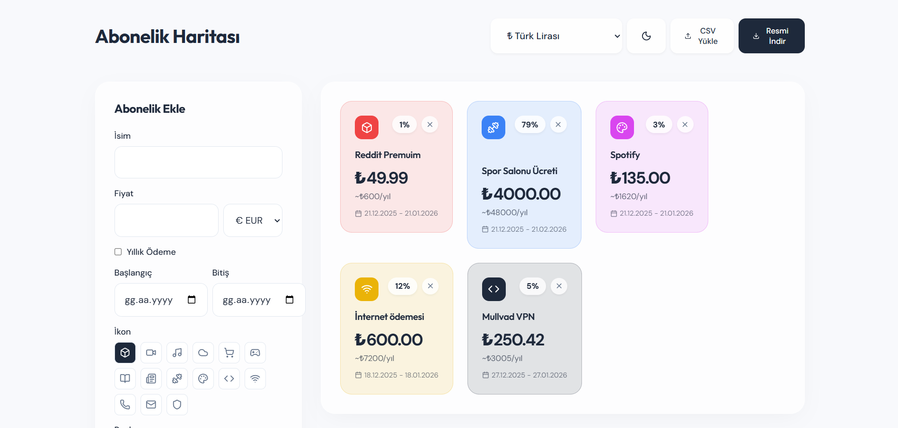
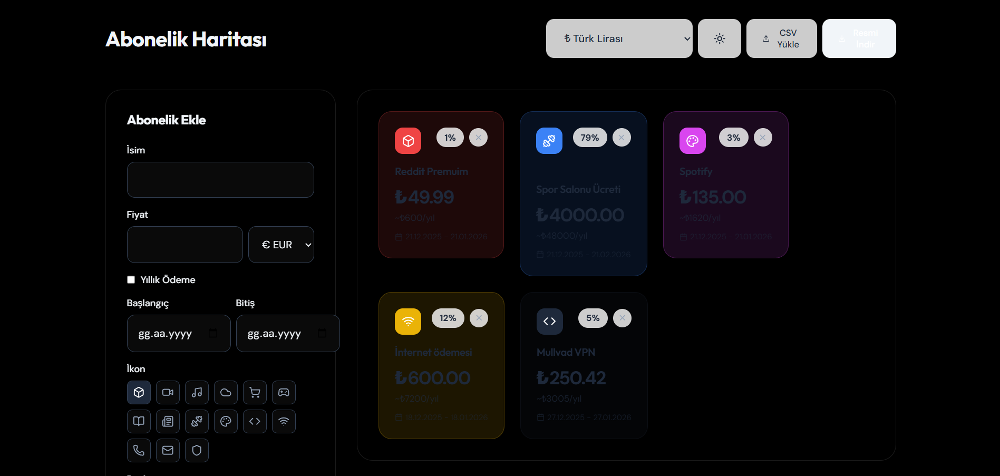
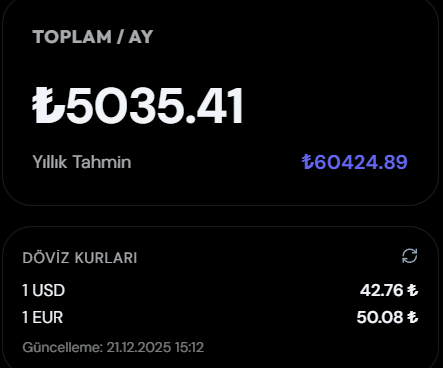
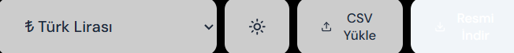
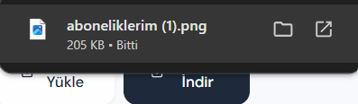

# E-Posta İçeriklerinizi Düzenlemek İçin Basit Bir Google Chrome Eklentisi

 
    &nbsp;&nbsp; &nbsp;&nbsp; &nbsp;&nbsp; 

---

## Eklenti ile alakalı birkaç ekran görüntüsü / A few screenshots related to the extension

     
    
    
    
    

### 🗺️ Subscription Tracker - Abonelik Haritası
TR
Spotify, Netflix, Adobe... Aylık ne kadar ödüyorsunuz? Bu uygulama ile tüm aboneliklerinizi tek bakışta görün.

Özellikler:

💱 USD, EUR, TRY desteği ve canlı döviz kurları

🎨 15 farklı ikon ve renk seçeneği

📅 Abonelik başlangıç/bitiş tarihi takibi

🔄 Sürükle-bırak ile sıralama

🌙 Karanlık/Aydınlık tema

📸 Haritanızı PNG olarak indirin

📊 CSV ile toplu abonelik ekleme

🔒 Tüm veriler tarayıcınızda saklanır. Sunucuya gönderilmez.

---

### EN
Spotify, Netflix, Adobe... How much do you pay monthly? See all your subscriptions at a glance.

Features:

💱 USD, EUR, TRY support with live exchange rates

🎨 15 different icons and color options

📅 Subscription start/end date tracking

🔄 Drag & drop reordering

🌙 Dark/Light theme

📸 Export your map as PNG

📊 Bulk import via CSV

🔒 All data stays in your browser. Nothing sent to servers.

---

### 💻 Proje Teknolojileri: / Project Technologies:

    

💡 **Eklenecekler / To Be Added**: Uygulama veya site olarak yayınlanacak. Eğer Web sayfasına yüklenmeden kullanmak istiyorsanız gerekli konfigürasyon ayarları ile yerel bir şekilde kullanabilirsiniz.

---

